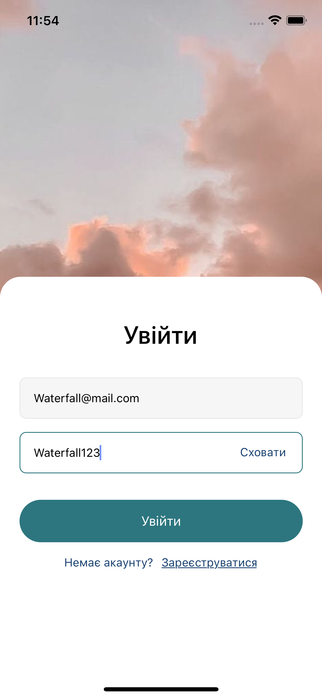
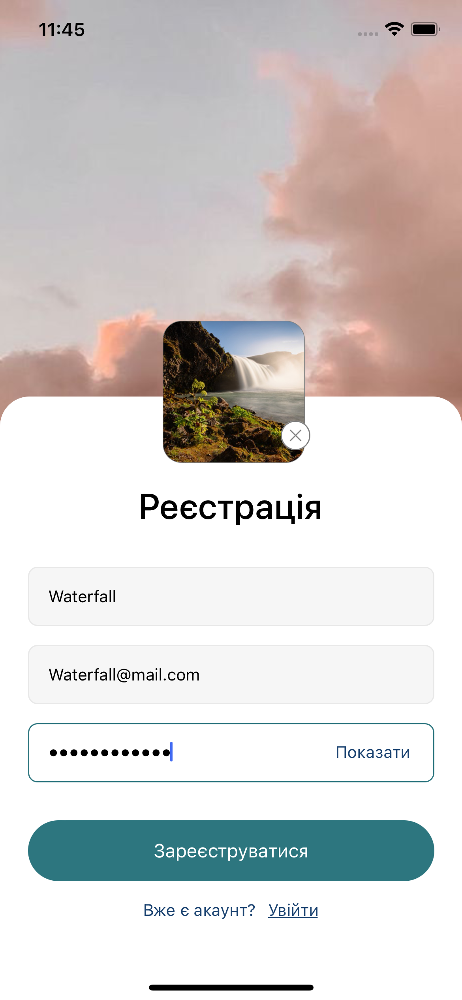
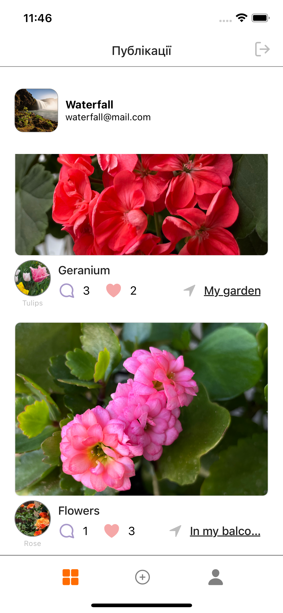
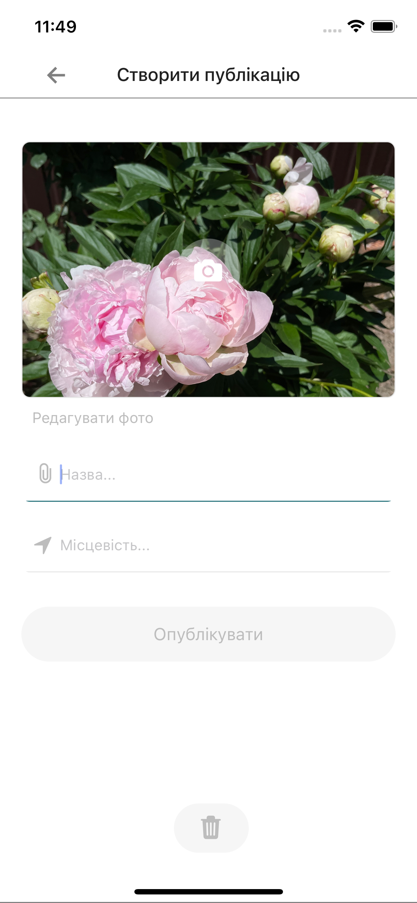
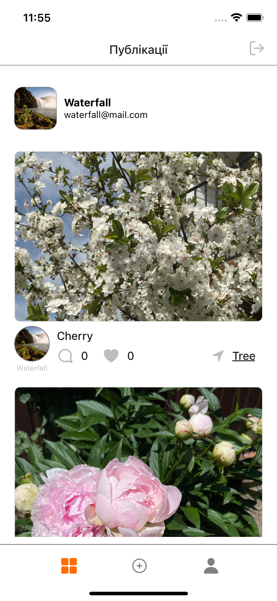
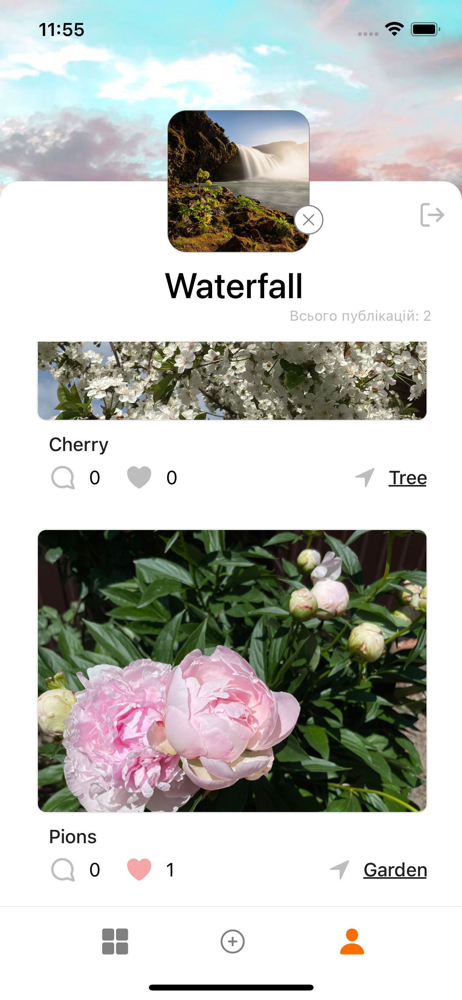
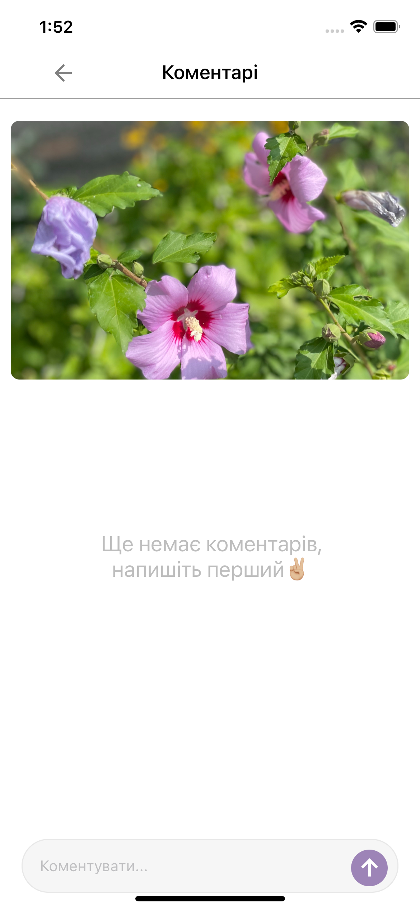
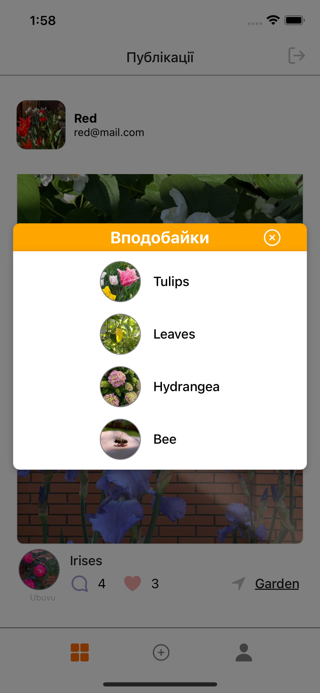

# Project name

My first react native project is an Expo native app (demo social network).

## Description

This native Expo application, developed as a first project, is a demo social network with the ability to log in / register / authorize users, create / add posts (comments and likes to them), change the current user data using firebase (authentication, firestore database , repositories, respectively).

## Installation

1. Make sure you have Node.js installed. If not, you can download it from the official site: https://nodejs.org/
2. Install Expo CLI globally by running the following command from the command line:

npm install -g expo-cli

Change to the project directory and install the dependencies by running the command:

npm install

## Usage

Run the project by running the command:

npm start

Scan the QR code in the Expo Developer Tools console/IDE terminal using the Expo app on your mobile device/camera, or run the project on the emulator by selecting the appropriate option in the console.

## Screenshots

<!--  -->

